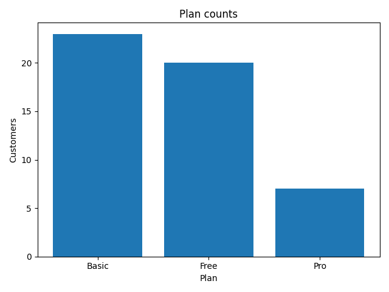
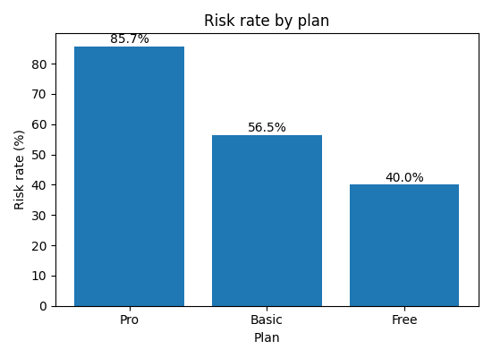
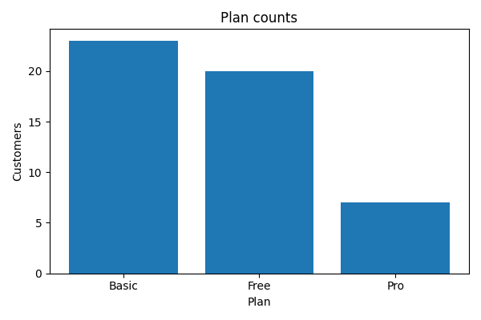
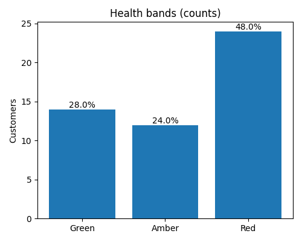
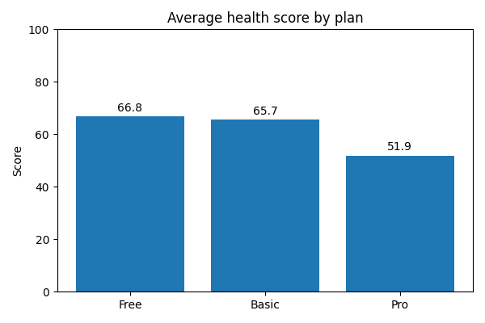
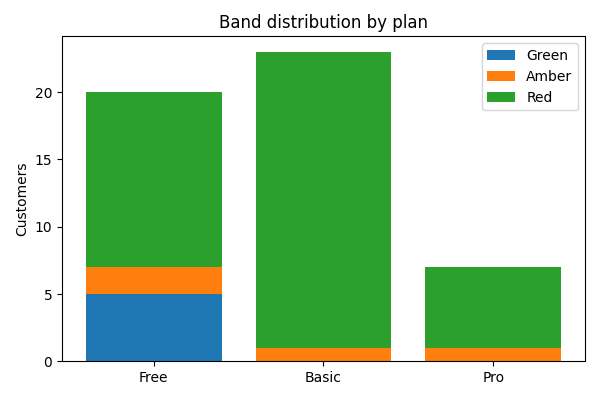

# Health Score Mock

Day1–4 done.

## What I did
- Day1–4: CSV集計/UNIXコマンド/API/デバッグ

## How to run
python3 scripts/python_api_example.py

## Plan breakdown


## Risk by plan



## MRR at Risk by plan


- リスク判定：30日以上未ログイン **または** 非アクティブ（active_flag=0）
- MRR at Risk：リスク顧客の月額合計
- プラン構成：Basic 23 / Free 20 / Pro 7（計50）
- 月額売上（推定）：199,000円
- リスク率：Pro 85.7%（6/7）／Basic 56.5%（13/23）／Free 40.0%（8/20）
- MRR at Risk：Pro 72,000円／Basic 65,000円／Free 0円
- プラン構成：**plan_counts.png**
- リスク率：**outputs/risk_by_plan.png**
- リスクMRR：**outputs/risk_by_plan_mrr.png**
- Proはリスク率・金額インパクトとも最大 → 最優先でフォロー導線（休眠前の接点強化）
- Basicは件数多め → アクティブ化施策の標準化（メール・FAQ・オンボ動画）
- Freeは影響小：上位プランへの導線テストを小さく回す

## 可視化


- [Plan counts](outputs/plan_counts.csv)
- [Risk by plan](outputs/risk_by_plan.csv)
- [Priority top10](outputs/priority_top10.csv)
\`\`\`bash
sqlite3 -header -csv day6.db < sql/plan_counts.sql    > outputs/plan_counts.csv
sqlite3 -header -csv day6.db < sql/risk_by_plan.sql   > outputs/risk_by_plan.csv
sqlite3 -header -csv day6.db < sql/priority_top10.sql > outputs/priority_top10.csv
\`\`\`
## 可視化リンク
- [Plan counts](outputs/plan_counts.csv)
- [Risk by plan](outputs/risk_by_plan.csv)
- [Priority top10](outputs/priority_top10.csv)

```bash
sqlite3 -header -csv day6.db < sql/plan_counts.sql     > outputs/plan_counts.csv
sqlite3 -header -csv day6.db < sql/risk_by_plan.sql    > outputs/risk_by_plan.csv
sqlite3 -header -csv day6.db < sql/priority_top10.sql  > outputs/priority_top10.csv
## 可視化

[](outputs/plan_counts.png)  
[](outputs/risk_by_plan.png)  
[](outputs/risk_by_plan_mrr.png)

## データ出力物
- [Plan counts](outputs/plan_counts.csv)
- [Risk by plan](outputs/risk_by_plan.csv)
- [Priority top10](outputs/priority_top10.csv)

## 再現手順（SQL → CSV）
```bash
sqlite3 -header -csv day6.db < sql/plan_counts.sql     > outputs/plan_counts.csv
sqlite3 -header -csv day6.db < sql/risk_by_plan.sql    > outputs/risk_by_plan.csv
sqlite3 -header -csv day6.db < sql/priority_top10.sql  > outputs/priority_top10.csv

echo "\" >> README.md
## 可視化

[](outputs/plan_counts.png)  
[](outputs/risk_by_plan.png)  
[](outputs/risk_by_plan_mrr.png)

## データ出力物
- [Plan counts](outputs/plan_counts.csv)
- [Risk by plan](outputs/risk_by_plan.csv)
- [Priority top10](outputs/priority_top10.csv)

## 再現手順（SQL → CSV）
```bash
sqlite3 -header -csv day6.db < sql/plan_counts.sql     > outputs/plan_counts.csv
sqlite3 -header -csv day6.db < sql/risk_by_plan.sql    > outputs/risk_by_plan.csv
sqlite3 -header -csv day6.db < sql/priority_top10.sql  > outputs/priority_top10.csv

cat >> README.md <<'MD'
## 可視化


## データ出力物
- [Plan counts](outputs/plan_counts.csv)
- [Risk by plan](outputs/risk_by_plan.csv)
- [Priority top10](outputs/priority_top10.csv)

## 再現手順 (SQL→CSV)
```bash
sqlite3 -header -csv day6.db < sql/plan_counts.sql     > outputs/plan_counts.csv
sqlite3 -header -csv day6.db < sql/risk_by_plan.sql    > outputs/risk_by_plan.csv
sqlite3 -header -csv day6.db < sql/priority_top10.sql  > outputs/priority_top10.csv
git status
git status

## Health score
**定義（0–100）**  
- engagement = `min(tickets_last_30d, 10)/10`  
- recency = `last_login_days_ago` が 0日=1 → 30日=0 へ線形  
- active = `active_flag`（1/0）  
- score = `round(100*(0.5*engagement + 0.4*recency + 0.1*active))`  
- band: **Green (>=80)** / **Amber (>=60)** / **Red (<60)**

### Distribution / by plan



### CSV
- [Health scores](outputs/health_scores.csv)  
- [Score by band](outputs/score_by_band.csv)  
- [Priority top10 by low score & MRR](outputs/health_priority_top10.csv)

## Band distribution by plan


## 可視化


## Reports
- [Plan summary](reports/plan_counts.md)
